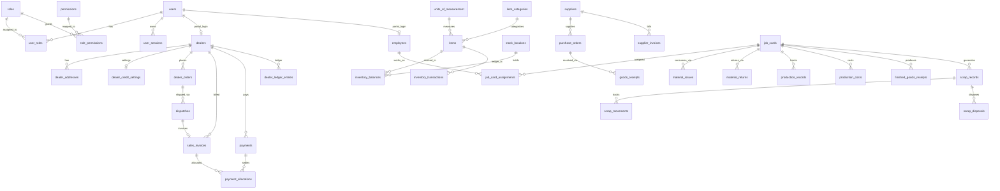

# Entity-Relationship Diagram

Matches `prisma/schema.prisma`.

```mermaid
erDiagram
    users ||--o{ user_roles : has
    roles ||--o{ user_roles : assigned_to
    roles ||--o{ role_permissions : grants
    permissions ||--o{ role_permissions : mapped_to
    users ||--o{ user_sessions : owns
    users ||--o| dealers : portal_login
    users ||--o| employees : portal_login

    dealers ||--o{ dealer_addresses : has
    dealers ||--o| dealer_credit_settings : settings
    dealers ||--o{ dealer_orders : places
    dealers ||--o{ sales_invoices : billed
    dealers ||--o{ payments : pays
    dealers ||--o{ dealer_ledger_entries : ledger

    units_of_measurement ||--o{ items : measures
    item_categories ||--o{ items : categorizes
    items ||--o{ inventory_balances : stocked_in
    stock_locations ||--o{ inventory_balances : holds
    items ||--o{ inventory_transactions : ledger_tx

    suppliers ||--o{ purchase_orders : supplies
    purchase_orders ||--o{ goods_receipts : received_via
    suppliers ||--o{ supplier_invoices : bills

    dealer_orders ||--o{ dispatches : shipped_via
    dispatches ||--o| sales_invoices : invoices
    payments ||--o{ payment_allocations : settles
    sales_invoices ||--o{ payment_allocations : allocated

    job_cards ||--o{ job_card_assignments : assigned
    employees ||--o{ job_card_assignments : works_on
    job_cards ||--o{ material_issues : consumes_via
    job_cards ||--o{ material_returns : returns_via
    job_cards ||--o{ production_records : tracks
    job_cards ||--o{ production_costs : costs
    job_cards ||--o{ finished_goods_receipts : produces
    job_cards ||--o{ scrap_records : generates
    scrap_records ||--o{ scrap_movements : tracks
    scrap_records ||--o{ scrap_disposals : disposes
```
